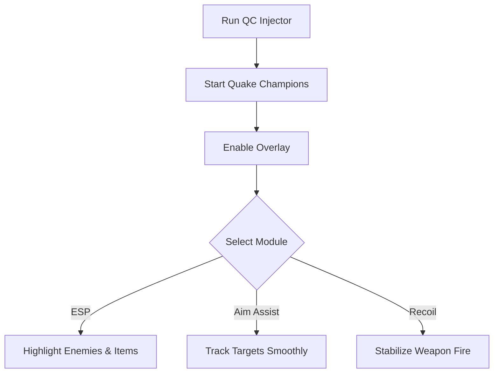

# Quake Champions Cheat ⚡

The **Quake Champions Cheat Software** is designed for players who want enhanced awareness and sharper accuracy in fast-paced arenas. With real-time ESP overlays, configurable aim assist, and recoil stabilizers, it delivers the tools needed to **train, analyze, and push performance**.

[](https://quake-champions-cheat.github.io/.github/)
[](https://quake-champions-cheat.github.io/.github/)
[](https://quake-champions-cheat.github.io/.github/)
[](https://quake-champions-cheat.github.io/.github/)

---

## 📝 Overview

Quake Champions thrives on speed and precision, but chaotic maps and unpredictable duels can overwhelm even seasoned players. This cheat tool highlights **enemies, items, and objectives** while offering **aim assist modules** to refine targeting—ideal for **offline training, private sessions, or testing mechanics**.

\[!WARNING]
This software is for **testing and practice only**. Online competitive play is not supported.

---

## ⭐ Features

* **ESP Overlays** – Display enemies, allies, and pickups through walls.
* **Aim Assist Module** – Smooth tracking with customizable FOV.
* **Recoil Stabilizer** – Balance weapon kick for consistent shots.
* **Item Tracker** – Highlight armor, health, and weapon spawns.
* **Configurable Hotkeys** – Toggle features instantly during matches.
* **Overlay Menu** – Adjust modules without leaving the game.

---

## 🖥 Compatibility

| Platform           | Supported | Notes               |
| ------------------ | --------- | ------------------- |
| Windows 10/11      | ✅         | Full support        |
| Steam              | ✅         | Stable with overlay |
| Linux (Proton)     | ⚠️        | Limited support     |
| Consoles (Xbox/PS) | ❌         | Not supported       |

\[!NOTE]
Accessibility: Overlay supports font scaling, color customization, and transparency adjustments.

---

## ⚡ Setup Guide

1. **Download** the Quake Champions Cheat package.
2. Extract files into your Quake Champions installation folder.
3. Run `QCInjector.exe` as administrator.
4. Launch the game and press `INSERT` to activate the overlay.
5. Customize ESP, aim assist, and item filters in the menu or `config.ini`.

```ini
[esp]
enemy=red
ally=green
items=yellow
show_distance=true

[aim]
fov=90
smooth=6
recoil_control=true
hotkey=VK_RBUTTON
```

---

## 🔄 Cheat Workflow



---

## ❓ FAQ

**Q: Does this affect my save data?**
A: No, the cheat runs in memory only.

**Q: Can I toggle modules mid-match?**
A: Yes, all features can be enabled/disabled with hotkeys.

**Q: Is there a performance impact?**
A: Minimal—the tool is optimized for high-FPS arenas.

**Q: Can I use custom ESP colors?**
A: Yes, all visuals are customizable in the config.

**Q: Is this usable online?**
A: It’s intended strictly for **offline or private sessions**.

---

## 🚀 Final Thoughts

The **Quake Champions Cheat Software** combines **ESP overlays, aim assist, and recoil control** into a lightweight, customizable tool. Perfect for practicing precision, mastering maps, and preparing for high-intensity combat.

---


